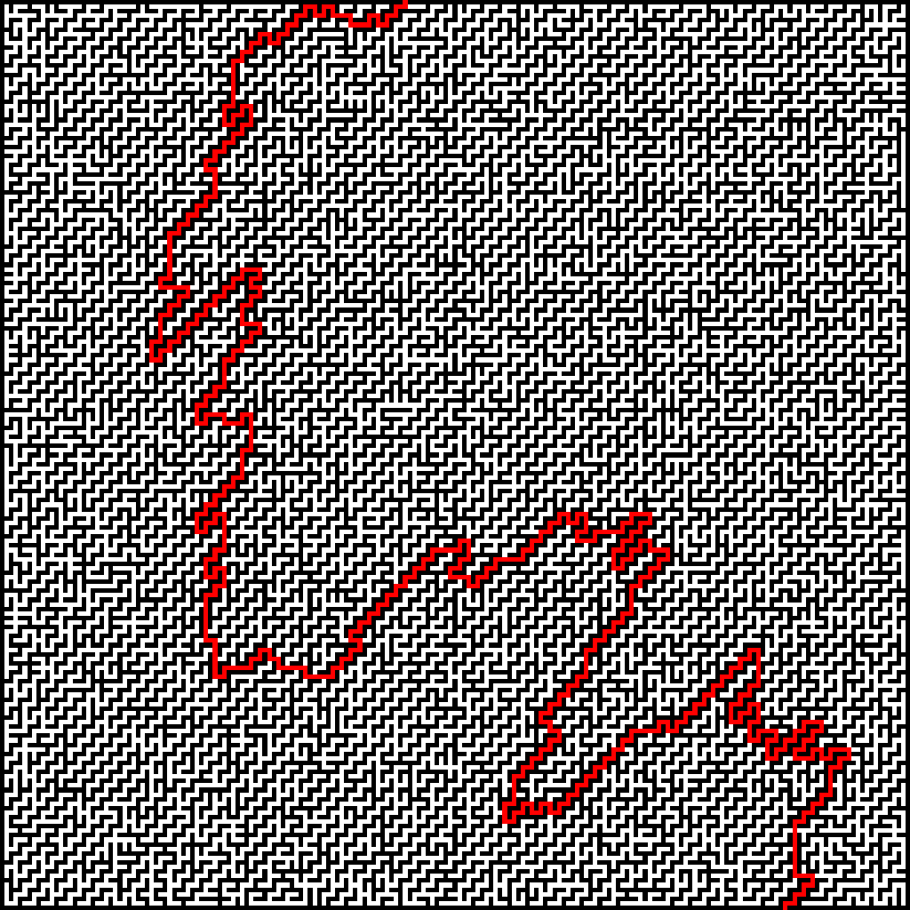
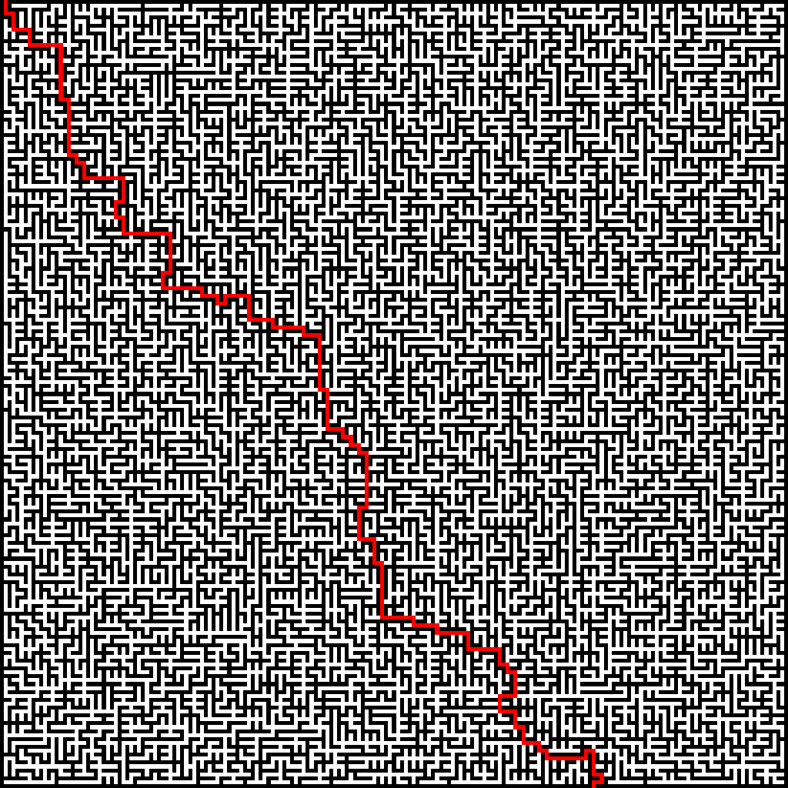

## A program for visualising graph search algorithms (and solving mazes).

  |  
:-------------------------:|:-------------------------:

# Search comparison:

BFS | Greedy BFS | A*
:-------------------------:|:-------------------------:|:-------------------------:
 |  | 

Since A* is not highly optimized, greedy bfs often performs as well as A* on small mazes.

# Usage

```bash
algernon width height mazetype solvetypes [bmp/svg/gif]
Defaults to PNG output.
Mazetypes: perfect, braid, diagonal, prim, sidewinder, spiral.
Solvetypes: bfs (breadth first search), gbfs (greedy bfs), astar. Combine with + to compare.

$ algernon 201 201 diagonal astar
$ algernon 501 1001 perfect bfs+gbfs+astar gif
```

 |  | 
:-------------------------:|:-------------------------:|:-------------------------:
 |  | 
